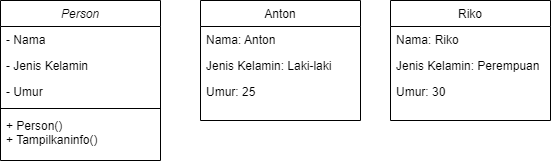

# Pemrograman Berorientasi Objek

## Latihan1

Apa yang harus didefinisikan sebelum membuat objek?

Sebelum membuat objek dari suatu class, kita harus mendefinisikan class tersebut. Class adalah cetak biru (blueprint) dari objek, yang berisi atribut (data) dan metode (fungsi) yang akan dimiliki oleh setiap objek yang dibuat dari class itu. Selain itu, konstruktor juga perlu didefinisikan jika kita ingin menginisialisasi atribut dengan nilai tertentu saat objek dibuat.

Langkah-langkah sebelum membuat objek:

Definisikan class: Berisi atribut dan metode yang diperlukan.

Konstruktor: Opsional, digunakan untuk memberikan nilai awal pada atribut.

Objek: Setelah class didefinisikan, objek dapat dibuat menggunakan new keyword.

Gambar Diagram Class dan Objek dari Class Person

Gambar Diagram Objek AkunBank

